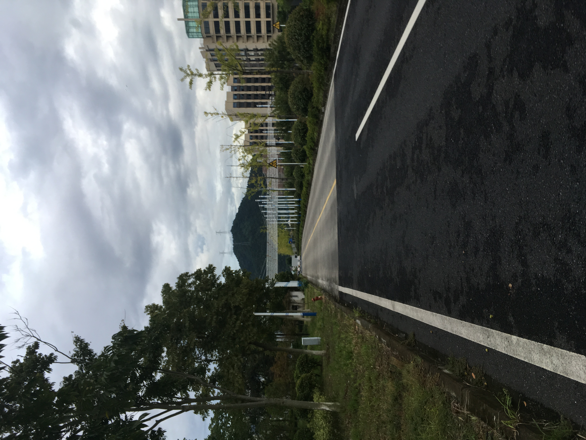

### 完整 富阳科三考试流程图

##### 完整 富阳科三考试流程图


##### 开始考试起点

```
进入考场在后靠大厅等候，等待叫号后进入考场对应的考试车，下车时候车门要先开一条缝向车后观望确认安全后打开车门，上车打卡后下车逆时针绕车一圈，并触碰车尾和车头的两个传感器，然后上车检查灯光和仪表盘是否有异常显示，调整座位，后视镜，检查变速杆是否是空挡，检查手刹是否拉起，系安全带
1,2,3,4;1 打转左向灯，2 打喇叭，3左右摇头看车门 4 踩离合器挂起步挡，5 踩刹车放手制动。做完这些动作后，先松刹车，缓抬离合器，车子开始起步，起步后如果转向灯还在没关数5秒后手动关闭转向灯，加油门 15 码，踩离合换二档，重复加油门 25 码左右换三档。车子开到主道上，先把车子拉直开平稳，行驶约 200 米把具体不知道。
```


##### 直线行驶

```
直线行驶，保持车子直线状态，速度平稳，手握方向盘不要太紧了，可以微调方向，大小不超过5度。目视前方300米处作为直线参考。直线开完100米后就结束了。接着准备下一个项目超越前方车辆。
```


```
直线行驶开始路段是在，最低最高速度显示牌的下一个蓝色的提示牌开始，估计直线开完100米后就结束了。
```


```
尽量车道上不要有车子在你前面，一定要车子正、档位3档、手不要紧握方向盘、发现跑偏，不要着急，慢慢微调！！
```


```
超越前方车辆：预计在下图这个位置，大概行驶50米把具体我也不知道；向下打左转向灯，3秒后开始变道，开到左边车道后，关闭左转向灯；约5秒后，驶回原来车道指令出来，向上打右转向灯，3秒后开始变道驶回原来的车道，驶回原车道后关闭右转向灯；这个项目完成。
超车、驶离超车道，打灯、3秒、扭头、变方向！注意：最好离前面车子远一点，超车道停车直接不及格！
注意：完成超越前方车辆只要保持车速平稳就可以，穿越隧道时不要压实线
```


```
下图是穿越隧道后的路段，考试时候对于这个路段没有指令要求，最好是要3挡不加油跑就可以了，这个段路上有个公交口但是不是考试项目，通过这个路段时候最好习惯性左右摇摆头，

注意前方是左转路口：对灯光不作要求，但是最好是开启左转向灯。
```


```
左转路口：对灯光不作要求，但是最好是开启左转向灯。
隧道出来，有个左转弯，基本上打灯，3档25一下过就好了，不建议停车一档过，因为之后马上就是加减档，容易过了之后，你正在加减档，就有口令出来了.
```


```
加减挡操作：左转路口过完后大约50米距离指令加减挡操作，听到后，左脚踩离合换2挡，慢松离合，听到请将档位换回3挡。右脚给点油使转速达到3挡规定，左脚踩离合换3挡，慢松离合。准备下一个项目。

加减档，过了弯道，速度大约是22左右，听到口令，带一点刹车降低车速到20，然后离合，挂2档，慢慢松离合，轻踩油门；听到加档，踩油门，速度25左右时候，离合挂3档！
这里千万注意，开头提到文章说，减到2档，离合不用松，是错误的！你不松离合，不会报让你加3档的，然后就直接说你空档滑行太久不及格了！亲生经历的！
```


```
通过学校区域：加减挡操作完成后50米左右，就是学校区域，保持在3挡不踩油门的速度，没有语音后左右两边观察一下（左右摇头多摇几下）就完成了。紧接着马上就要出大门了。
```




```
通过学校区域：加减挡操作完成后50米左右，就是学校区域，保持在3挡不踩油门的速度，没有语音提示，语音提示被取消但是还是要左右两边观察一下（左右摇头多摇几下）就完成了。紧接着马上就要出大门了。
```


```
下图前方就要准备出大门，听到指令向上打右转向灯。
```


```
准备出大门，这里是一个直角弯注意不要压到路中间的实线，指令前方右拐；听到指令向上打右转向灯，当肩膀与外挂空调平齐的时候停车换一档，准备半联动转弯（跟科目二一样只用离合器前进），缓慢行驶，汽车开到中心线快看不到后，向右打一圈半，车子转到后拐弯车道后迅速回正，保持半联动状态停一下车，右转向灯如果自己灭了的话继续开启，因为出门车子开到看不到黄线又要拐弯一圈半，行驶到公路内车道上（靠近黄线的那个车道），一定不要开错车道，也不要压黄线。
```


```
准备出大门，当肩旁与大树平齐的时候，向右打一圈半（右打死），车身与路边线平齐后回正。
停车，摇头，1档，半联动，车头压黄线右打死，速度如果超过5码，慢慢松光离合，带一点油门到门口地方停下！这里注意，不要半联动超过5秒，不然会扣10分（不会合理使用半联动），所以要松光离合，不能给油的情况，又把离合踩下去，停下来好了。
```


```
我们要出的大门。
大门口右转，打灯，停车，摇头，1档，半联动，车头压黄线右打一圈，速度如果超过5码，慢慢松光离合，带一点油门，转到左拐车道上。
```


```
下图 坐在车内看不到车头白线时候 停车。前方有和黄线平行且离得比较近的白色带箭头细白线 。
大门口右转，打灯，停车，摇头，1档，半联动，车头压白色带箭头细白线右打一圈，速度如果超过5码，慢慢松光离合，带一点油门，转到左拐车道上。
不要半联动过久，我是半联动到5码，松离合，带点油门。
```


```
我们要出的大门道路向右方向。
大门口右转，和上述步骤一样，打灯，停车，摇头，1档，半联动，车头压和黄线平行且离得比较近的白色带箭头细白线右打一圈，，速度如果超过5码，慢慢松光离合，带一点油门，转到左拐车道上。
```

```
9、路口左转，可能排队的车子比较多，可以挂空档等待，不过不建议乱动，双手离开方向盘——我tmd关个窗户，安全员就吼过来了，你干什么？你干什么？终于等到我走到斑马线附近了，此时红绿灯倒计时已经跳到5了，于是我停下来了，安全员又吼过来“绿灯为什么不走？你平时走路绿灯不走么？要红灯走么？好了，现在红灯了，你走啊！你走啊！国家法律怎么规定红绿灯通行的！下个红绿灯你这样，我就不好意思了！....”整整骂了我一个红绿灯的时间，压力山大啊！路口左转，注意转向灯，起步之前一定要注意转向灯，然后一档，半联动，碰线一圈，可以将离合踩到底，然后慢慢再又半联动，总之不要半联动过久，我是半联动到5码，松离合，带点油门。

注意：第一、宁愿等红路灯也不要闯红路灯，不要再人行横道停车。第二、如果有特殊情况就把离合压好把车速控制最低缓缓行动。第三、不要半联动超过5秒
```

```
对这是一个路口
```

```
左转过来直行一段路，加档到2、3、4 ，对是的要加到 4挡 必须加到4档。
注意：这段路要加到4档最好是来回都加到4档。这段路会从厂里开出大车，可以停车挂一档等待大车走远，然后在起步挂1档2档3档4档
```

```
对是同一个路段
```

```
直行会到达这个路口，到达这个路口前会语音播报前方左转或者前方右转，这是随机播报的。我们加入它播报的是右转，路口停车摇头，打灯，一档，半联动，碰线一圈，进入最内侧车道（前方掉头），加档到2或者3.
```

```
井盖一根是，车头碰到井盖停车，前方还有一根细长带箭头的线碰线打一圈
```

```
掉头，路口停车，打灯，一档，半联动，打一圈，进入缺口，然后左右摇头观察，没问题，慢慢松离合，5码以上，送掉离合给油，加到2/3档，进入右转环节。
```

```
掉头，路口停车，下图 左边第一根白线停车挂一档，第二根白线打一圈，注意左右摇头观察，没问题，慢慢松离合，有问题停车等待，等到没有没问题时候前行。
```

```
左转，路口停车摇头，打灯，一档，半联动，碰线一圈，车头12点对准铁皮回正，碰斑马线，再打方向，最后回正，加档到3、4档，保持直线行驶。
```

```
回来的路口右转，有红绿灯，等呗，打灯好，等吧，遇到我时候，已经倒计时了，心里一横，半联动，5码松离合，加油门，碰线打一圈，进入车道，回正，加油挂档到3档，准备前面路口左转进入考场。
```

```
左转有红绿灯（会人为放一个在路口），打灯好，等灯亮，对向有车，千万不要抢，停下来让行，半联动，碰线一圈，5码松离合，略加油门冲上大门的坡道，上去后，马上挂档到2、3.
注意：即使不是红灯也要停车挂一档在人行横道前停车。当车头触碰到前面细白线的时候 向左打一圈。
```

```
公交车站、会车、人行横道记得摆头，速度不要超过30，我是25还松了下油门。
```

```
公交车站、会车、人行横道记得摆头，速度不要超过30，我是25还松了下油门。
```

```
靠边停车，不要着急，等前面车子走了，不然跟车太近，可能被不爽的安全员给踩刹车哦，投诉都无效。打灯、1档半联动，5码松离合慢慢给油，微调方向，基本上前面引擎盖上的小镜子看到车身没过白线，可以慢慢回方向，摆直车身，然后空档、手刹、关闭方向灯，等安全员发话让你下去拿成绩单了。
```

```
公交车站、会车、人行横道记得摆头，速度不要超过30，我是25还松了下油门。
```

```
注意靠边停车，听到靠边停车指令后 打右转向灯然后停车挂一档（因为现在是可能是3档的速度，打转向灯后不能动方向盘因为要等3秒，当停车挂一档在起步的时候已经过了3秒可以打方向盘了），慢慢靠。感觉快到50米了，停车重新起步再靠。停车时期间千万别压线。挺好和不能超过终点线。可以慢慢回方向，摆直车身，然后空档、手刹、关闭方向灯，等安全员发话让你下去拿成绩单了。
```


### 🎉 科目三考试并不难，按教练教的方法操作，胆大心细.完全可以轻松搞定！

##### 1.死的太冤: 模拟灯光出错

##### 2.死有余辜：上车不系安全带

##### 3.死不瞑目:手刹没松到底

##### 4.死不足惜：忘记打忘记关转向灯

##### 5.死得可耻：开转向灯不够三秒

##### 6.视死如归：起步不绕车一圈

##### 7.死于非命：挡位速度不匹配

##### 8.死得其所：直线行驶跑偏

##### 9.不知死活：忘了公交站、学校、路口减速观望

##### 10.死不悔改：熄火不回空档、起步不用一档

- [ ] 上车前环车查看
- [ ] 准备前调整座位，踩离合，刹车，系好安全带
- [ ] 关闭所有灯光，检查仪表是否有异常（车门，远光灯等，除手刹指示灯外都应熄灭）
- [ ] 开始灯光考试，灯光结束后，踩下离合与脚刹，左转向灯打起，连按两次喇叭或长按一次喇叭，挂好一档，松手刹；观察左后侧车辆，先慢抬脚刹，若无溜坡直接松开脚刹，若有溜坡轻踩下去；慢抬离合，车身抖动前行，驶入左侧车道
- [ ] 半联动行驶数 1001.1002.1003 后左脚离开离合器，右脚迅速放到油门踏板上，方向正后，若方向灯未灭，手动熄灭。迅速把油加上，提到 10 至 15 码，松油门，踩离合，切到二档；
- [ ] 稳住方向，加到 20 至 25 码，松油门踩离合，切至三档
- [ ] 稳住方向，会提醒“前方保持直行”，此时不要随意动方向盘，如有必要，一定只能小幅度调整，大幅度调必然挂科；
- [ ] 30 至 50 米后会提醒“超越前方车辆”，先打左转灯，心里默数“一二三”后，看左后视镜无车后，微小调整方向盘左转
- [ ] 5 至 10 秒后，会提醒回到超车前的车道，先打右转向灯，心里默数“一二三”后，看右后视镜无车后，微小调整方向右转
- [ ] 保持三档行驶，速度保持在 20 至 25 之间，数十米后进入隧道前，送油门，控制好方向通过隧道，不要压到右边实线，尽量不要压到中心实线，在驶离隧道前的虚线附近，可微小压过虚线，保持在右车道行驶。
- [ ] 控制车速，保持三档，此时可能有加减档操作，按语音提示操作，注意减档前不要踩油门，松离合的时候慢抬离合衔接，防止车速过快而抖动
- [ ] 保持右车道行驶，经过右侧汇入车道时松开油门，经过前方弯道左转，压过中心虚线，进入左车道。期间可能提醒加减档位操作，按语音提示操作，不要提前。注意可能提醒前方学校或会车，注意左右摇头看
- [ ] 前方可能有其他考试车，注意减速。同时语音提示右转，记得打右转灯，到房子前停一下，注意档位归到一档后再起步。若期间转向灯熄灭
      ，自己再打起来。车把手到右边大树时向右打死右转，准备出考区大门。
- [ ] 出考区大门前记得先打右转灯，同时向左探看是否有车，无车后前行，车前碰白线向右一圈驶出考区大门，进入道路左侧车道
- [ ] 加速到 2 档，适时停下，归一档，准备听语音提示，打左转灯，接近人行道，在人行道前必须停下。注意档位归到一档。等待前方车离开人行道一个车身以上距离再起步
- [ ] 待接近前方白线向左打一圈，进入到右侧车道，同时加速从一档到二档再切入三档
- [ ] 听语音提示向右转，打好右转向灯，记得前方路口停车，切回一档再行驶。
- [ ] 碰前方白线右向打一圈，进入左侧车道，加到二档
- [ ] 听语音提示，注意调头，打左转灯，在靠近掉头位置前三到五米停下，归一档起步，向左一圈准备调头，右侧头观察右方来车，随时踩下离合和刹车。
- [ ] 方向归正后，迅速加油门提至二档，听语音打左转灯，靠至人行道前停下，归一档，看前方白线再左转一圈，归正再左转，再归正，进入右侧车道
- [ ] 提速至三档，之后适时调整档位，等语音提醒，打右转灯，准备右转。
- [ ] 注意红绿灯控制前后车距，人行道前停下，归至一档。绿灯亮后有足够时间再一档进入路口，注意五码后，左脚离开离合，碰白线向右一圈，进入左侧车道，迅速提至二档，向前，听语音准备左转回到考区大门
- [ ] 在线前停下，看红绿灯操作，不要闯红灯，左转一圈进入考区大门。上坡记得猛踩油门，上完坡即切二档，适时切至三档。
- [ ] 前方提示注意行人，或学校，或会车，注意左右摇头观看。可能提示加减档操作，按语音提示操作
- [ ] 前方直行，准备停车。注意打右转灯，降速并停下
- [ ] 归一档，右转 40 度（稍高于左边转向灯位置）慢抬离合，右前方后视镜看车边缘贴线后停车，方向盘打到左边 90 度左右，慢抬离合车身贴合白线踩离合，停车踩刹车，挂空挡，拉手刹。等成绩出来后抬离合脚刹。解安全带再下车
      注意事项
- [ ] 打灯一定要超过三秒后才转向，这里丢分非常冤枉
- [ ] 超车一定是微小调整方向盘，否则扣分
- [ ] 有的车挡位不好挂上去，一定要确保离合踩到底以后，挂死再松离合，否则空挡踩油门直接扣 100 分
- [ ] 红绿灯一定要看，一定要注意前车距离一个车身的时候再过人行横道以及路口
- [ ] 脚不要长时间放在离合上，否则扣分
- [ ] 若熄火，一定要在空档点火，否则扣分
- [ ] 会车、结束会车、路过公共汽车站，学校都需要扭头左右看
- [ ] 如果前方没把握，可以中途停车挂一档重新起步
- [ ] 一档行驶不能超过 50 米（尽可能 30 米内切二档），二档不能超过 100 米（尽可能 80 米内切换档位）
- [ ] 一档切二档最低速 10 码（尽可能不要过 15），二档切三档最低 20 码（不要过 25）
- [ ] 刹车尽量不要一脚踩死，否则容易惹得安全员不开心
- [ ] 靠边停车停不好只要不拉手刹可以停多次调整。
- [ ] 松离合一定要注意，半联动必须稳住脚，从一数到三再松，否则松太快容易熄火。
- [ ] 停车后要记得挂一档起步，熄火后回空挡点火，车正后及时关闭左转向灯。
## 心得注意事项-流程总复习
- [ ] 安全员催不要理睬，但要礼貌些。
- [ ] 全程不能压线，1档距离不能超过50米，2档距离不超过80米。
- [ ] 出现复查车况立即停车，不要停在斑马线，起步记得挂一档。
- [ ] 内围走右车道，外围走左车道。
- [ ] 换档位快和准，不准低头看。
- [ ] 超车时打完灯3秒后才能动方向盘，超车后记得回灯。
- [ ] 外围所有路口都是打一圈方向盘转弯，内围出大门前的右转弯，方向盘打一圈半。
- [ ] 所有路口转弯处前都有黄线作为转弯参考线，外围有两个路口是看第二根黄线，因为走的是左车道不要看错。
- [ ] 半联动不能超过7秒，路口转弯，掉头，都要早点松掉离合，1档过弯。


## 科三道路考试最易丢分的7个环节
### 01、灯光丢分区
- [ ] 1、上车检查——重点看看看看远光灯关了没。
- [ ] 2、听令再动——不要抢口令，听清播报后，考虑1秒，再进行操作。
- [ ] 3、注意远光——只有口诀中的两处，最后是停在远光灯上的，在进行远近光交替操作时，要注意最后停在近光上。
### 02、起步丢分区
- [ ] 1、绕车一周——一般两个雷，一是考官一催就忘了依次按感应按钮，二是没留意停车位置及路面情况。
- [ ] 2、开门后看——急急匆匆上车，开门之前无视后方是否有来车。
- [ ] 3、灯光陷阱——完成临时停车或发生故障难以移动的灯光语音后，下一个指令忘记开大灯；上一个学员挂在灯光上，远光灯没复位，上车后未将灯光复位重开。
- [ ] 4、太早操作——语音播报到一半，就忙着进行操作，结果系统没识别，中雷。
- [ ] 5、起步着急——换车不习惯，加上心里不淡定，很容易忙中出乱，手刹忘松、离合放太快，都会导致熄火中雷。
### 03、细节丢分区
- [ ] 1、左右转向——转向灯，老生常谈的问题，通过左转右转路口，不打转向灯，依旧是最大丢分区。
- [ ] 2、直行刹车——有的考试路线，会有直行通过路口，甚至还有红绿灯，绝对不能忽略前面的红绿灯，并且要不提前刹车减速。
- [ ] 3、速度挡位——操作不熟练，挂挡生疏，总挂错挡位或者离合踩不到位，容易中这个雷。
- [ ] 4、空挡滑行——习惯了科二长时间踩离合，科三了，踩上去就忘了抬，而除了挂空挡行驶，离合踩太久不放，超过10秒就挂。
- [ ] 5、红灯熄火——等红灯的时候，可能遇到频繁停车起步，很考验人，操作不好就容易挂，这是一个雷；还有第二个，就是熄火之后匆忙起步，忘了摘空挡。
- [ ] 6.、观察不足 —— 超车操作需要两次回头观察，不要省略。
### 04、直线丢分区
- [ ] 1、一动不动——直线行驶，并非方向盘一动不动，那样更容易跑偏、压线。
- [ ] 2、顾近忘远——只依靠近处的参照物，来判断是否偏航，不懂目视远方判断是否走直，往往发现偏了已经太迟。
- [ ] 3、超速行驶——直线行驶，大部分精力都在方向盘上，很容易忽略了油门，控制不好就超速。
- [ ] 4、低头换挡 —— 直线行驶换挡时，一定要注意前方路况，否则走偏不说，还容易发生危险。
### 05、减速丢分区
- [ ] 1、无动于衷 —— 有的考试路线，取消了语音播报提醒，学员甚至对路旁标识视若无睹，到了点位也忘了减速操作，导致超速挂科。
- [ ] 2、太过谨慎 —— 远远看到路牌就减速，殊不知有的地区，是在站点前30米距离内，识别刹车动作，系统识别操作无效。
- [ ] 3、速挡不合 —— 掉头或转弯速度较慢，却使用高档位，都可能导致扣分和挂科。
### 06、超车丢分区
- [ ] 1、超过距离——有的地区，超车距离限制在200米以内，如果不手脚麻利，容易超出范围。
- [ ] 2、观察不足——两次向后观察，左变道和右回道都要向后观察，尤其是第二次，自己知道后面没车，忘了观察。
### 07、停车丢分区
- [ ] 1、距离过长——停车距离是有限制的，所以听到语音播报以后，打完右转向灯后，可以先提前减速，否则一个不慎，稍微楞一会儿，几十米就出去了。
- [ ] 2、停车压线——总想一步停到位，总想再靠近一点，结果压线了。
- [ ] 3、位置不佳 —— 看点不准，离路边缘线太远或者压线。
- [ ] 4、过度兴奋 —— 临近考试结束，有的学员未等播报就解开安全带，直接下车，临门一脚反而失利。

## 90%科三挂科的学员问题都出在这里